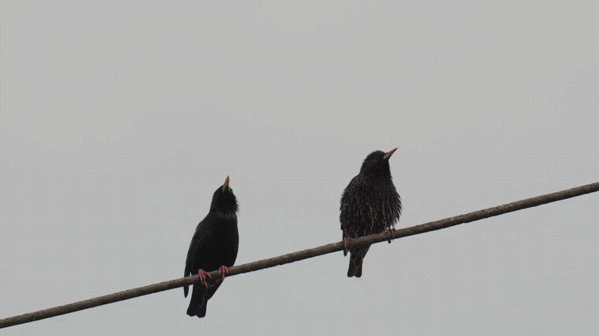
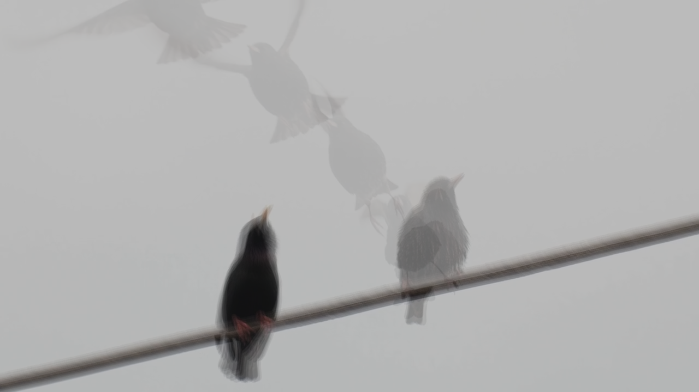

   
 
 

__Blend video frames, or images, to make nice visualisations!__
 
 

## Try it:

__step 1)__ Download repo:
 
`git clone https://github.com/nemanja-rakicevic/frame_blender.git; cd frame_blender`

__step 2)__ Prerequisites:
 
`pip install -r requirements.txt`

__step 3)__ Run!
 
`python blend_frames.py --load_gif examples/example_gif.gif -sf 5`
 
 

## Description

Scripts for manipulating the open browser tabs:

__blend_frames.py__:
 
Create an image of blended frames, from various sources:
 
`-v, --load_video`: pass a path to the video file.
 
`-g, --load_gif`: pass a path to the .gif file.
 
`-d, --load_dir`: pass a path to the directory containing a sequence of images.
 
It is necessary that the images are the same size, and would be useful to also pass the image type: 
 
`-it, --image_type`: the default is `'png'`.

It is possible to limit the number of frames used:
 
`-mf, --max_frames`: by default all frame are used.
 
In order to skip several frames, pass:
 
`-sf, --skip_frames`: the default is tu use all frames.

__(TODO) make_gif.py__:
 
Make a gif either from a video file or a sequence of images.
 
 

__(TODO) make_image_sequence.py__:
 
Make a sequence of images either from a video file or gif.
 
 

NOTE: Large files require a lot of memory, use with caution!
 
(TODO) Rewrite as iterators to better manage the memory.
